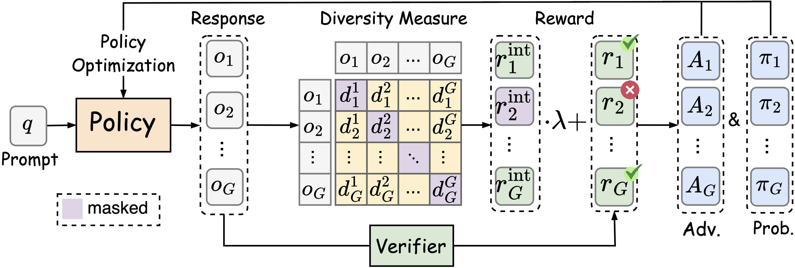
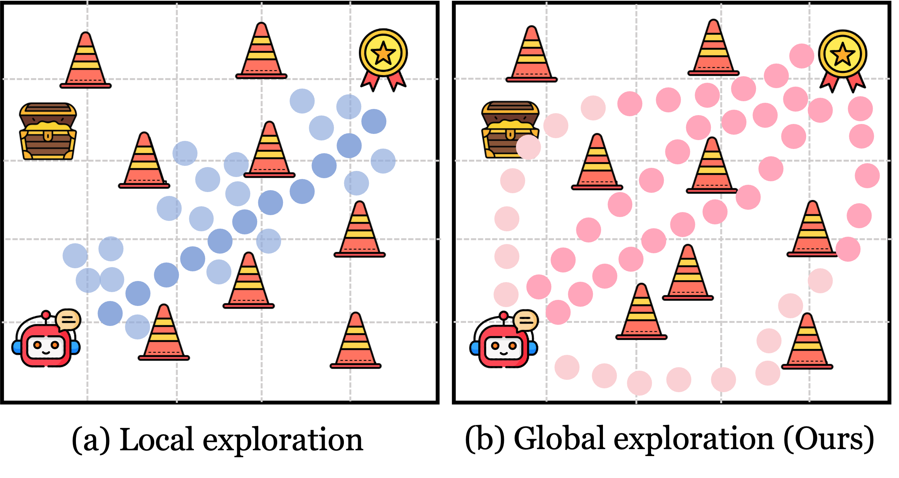
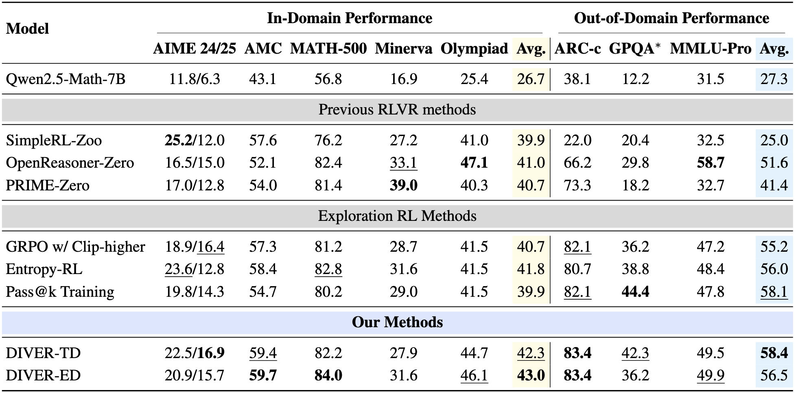
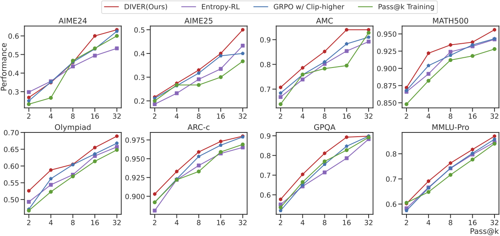

<h1 style="display: flex; justify-content: center; align-items: center; gap: 10px; margin: 0;">
  Diversity-Incentivized Exploration for Versatile Reasoning
</h1>
<p align="center">


<p align="center">
  <a href="https://arxiv.org/abs/2509.26209"></a>
<a href="https://huggingface.co/collections/huzican/diver-68e75c37734c8305aa51d5ef"></a>
  <a href="https://github.com/NJU-RL/DIVER/stargazers"></a>
</p>


Zican Hu<sup>12*</sup>, Shilin Zhang<sup>12*</sup>, Yafu Li<sup>2†[✉]()</sup>, Jianhao Yan<sup>42</sup>, Xuyang Hu<sup>2</sup>, Leyang Cui<sup>4</sup>, Xiaoye Qu<sup>2</sup>, Chunlin Chen<sup>1</sup>, Yu Cheng<sup>3[✉]()</sup>, Zhi Wang<sup>12[✉]()</sup>

<sup>1</sup>Nanjing University  <sup>2</sup>Shanghai AI Laboratory  <sup>3</sup>The Chinese University of Hong Kong  <sup>4</sup>Westlake University

<sup>*</sup>Equal contributions. Zican Hu and Shilin Zhang are listed alphabetically by last name. <sup>†</sup>Project lead. <sup>[✉]()</sup> Corresponding authors.

**Contact:** zicanhu@smail.nju.edu.cn, shilinzhang@smail.nju.edu.cn, yafuly@gmail.com, chengyu@cse.cuhk.edu.hk, zhiwang@nju.edu.cn

## ⭐**Overview**


---

## 📖Introduction
We first conduct a primary empirical study to reveal a strong positive correlation between global diversity and reasoning capacity, and propose **DIVER**, an innovative framework that highlights the pivotal role of global sequence-level diversity to incentivize deep exploration for versatile reasoning. Building on this insight, we introduce **global diversity incentives as an intrinsic reward to promote deep exploration in a semantically structured space**.
Incorporating the intrinsic reward, we develop a potential-based reward shaping mechanism to preserve optimal policy invariance and design simple heuristics to mitigate possible reward hacking.

### Key Highlights:
- **The sequence-level vs. token-level Diversity on RLVR**
- **Metrics for Quantifying sequence-Level Diversity**
- **Promoting Global Diversity for Deep Exploration**
- **Mitigating Reward Hacking**

  <div align="">
    
  </div>
---

## 🚀Usage

### Installation

```bash
conda create -n diver python=3.10 -y
conda activate diver
pip install -r requirements.txt
```

### Preparation
```bash
cd dataset
huggingface-cli download --resume-download huzican/DIVER-Training-Openr1-Math-46k --local-dir openr1
huggingface-cli download --resume-download huzican/DIVER-Test --local-dir valid.all

cd model
huggingface-cli download --resume-download huzican/Qwen2.5-Math-7B-16k-think --local-dir Qwen2.5-Math-7B-16k-think
```

### Training
```bash
  export MODEL_PATH="Qwen2.5-Math-7B-16k-think"
  bash scripts/train/train_diver.sh --model $MODEL_PATH
```
### Evaluation
```bash
  export CHECKPOINT_PATH="checkpoints/diver"
  bash scripts/eval/eval_checkpoint.sh --model $CHECKPOINTS_PATH
```

## 📊Main Results
### Zero RLVR on DIVER vs. Basline based on Qwen2.5-Math-7B
<div align="center">
  
</div>

### Comparison of different Pass@k performance
<div align="center">
  
</div>

## ✨Acknowledgement
DIVER builds upon [veRL](https://github.com/volcengine/verl) and [deepscaler](https://github.com/agentica-project/rllm), and utilizes [vLLM](https://github.com/vllm-project/vllm) for inference. We utilize [Math-Verify](https://github.com/huggingface/Math-Verify) for RLVR reward model. 
We thank the open-source community for datasets and backbones, including [OpenR1-Math-220k](https://huggingface.co/datasets/open-r1/OpenR1-Math-220k), [OpenR1-Math-46k](https://huggingface.co/datasets/Elliott/Openr1-Math-46k-8192), [Qwen-2.5](https://huggingface.co/collections/Qwen/qwen25-66e81a666513e518adb90d9e) and [Llama-3.1](https://huggingface.co/collections/meta-llama/llama-31-669fc079a0c406a149a5738f) model. 

## 📝**Citation**

If you find our paper useful, please consider to star this repository and cite it:
```tex
@article{hu2025diversity,
  title={Diversity-Incentivized Exploration for Versatile Reasoning},
  author={Hu, Zican and Zhang, Shilin and Li, Yafu and Yan, Jianhao and Hu, Xuyang and Cui, Leyang and Qu, Xiaoye and Chen, Chunlin and Cheng, Yu and Wang, Zhi},
  journal={arXiv preprint arXiv:2509.26209},
  year={2025}
}
```